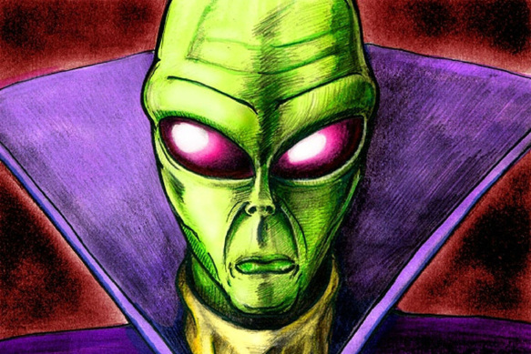

{{}}

Xenu (/ˈziːnuː/), also called Xemu, was, according to Scientology founder L. Ron Hubbard,
the dictator of the "Galactic Confederacy" who 75 million years ago brought billions
of his people to Earth (then known as "Teegeeack") in DC-8-like spacecraft, stacked them around volcanoes,
and killed them with hydrogen bombs. Official Scientology scriptures hold that the thetans (immortal spirits)
of these aliens adhere to humans, causing spiritual harm.